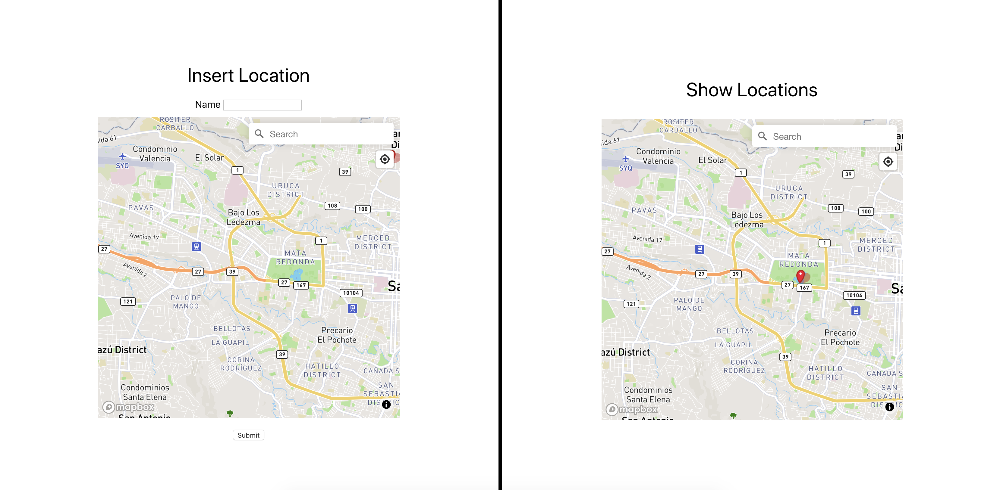
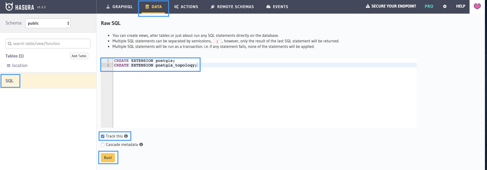
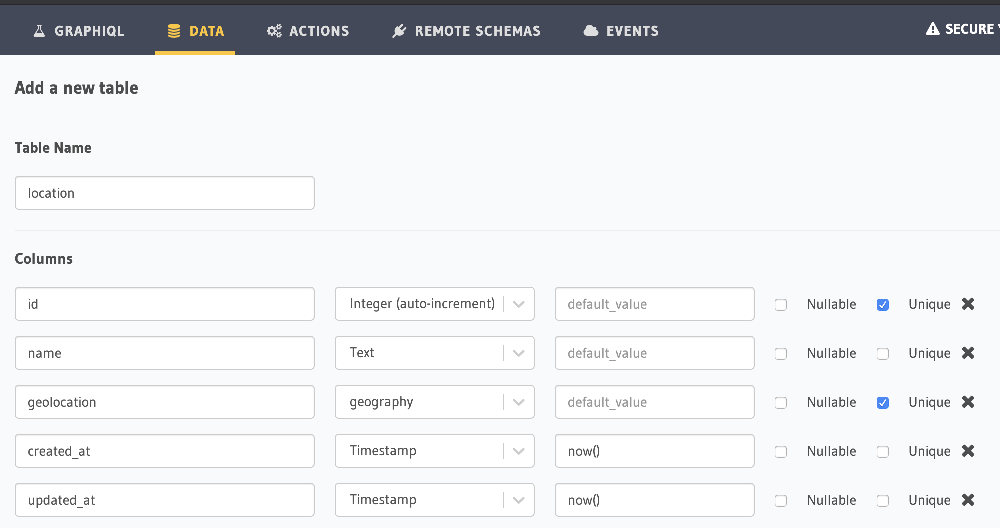

# Nearby Geolocation.

By participating in the [EOSIO VIRTUAL HACKATHON](https://devpost.com/software/blockdrive) our team [EOS Costa Rica](https://eoscostarica.io/) developed [lifebank](https://lifebank.io/)(application that uses blockchain technology to save lives. After completing a donation at any registered Lifebank, a life donor will earn a Life Token that can be redeemed at a local sponsor)

My contribution was developing the maps to be able to insert and show locations, at the beginning it seems difficult but investigating and thanks to Hasura and Postgis it was not, so now I want to share my experience and how you can create a map to get nearby locations in the easiest way.

You can see a live demo [here](https://master.d3ky1qvagqan3x.amplifyapp.com/)

## Tech Stack:

### [Backend](https://github.com/kecoco16/nearby-geolocation/tree/master/hasura)

- [Hasura](https://hasura.io/)
- [Postgresql](https://www.postgresql.org/)
- [Postgis](https://postgis.net/)

### [Frontend](https://github.com/kecoco16/nearby-geolocation/tree/master/app)

- [React](https://reactjs.org/)
- [Apollo](https://www.apollographql.com/docs/react/)
- [Mapbox](https://www.mapbox.com/)



## Demo app

### Backend

The first thing to do is run hasura and Postgres with PostGIS, there are 2 ways to do this.

#### Using Docker

Run the app locally

- First you need to have [Docker](https://docs.docker.com/get-docker/) and the [Hasura CLI](https://hasura.io/docs/1.0/graphql/manual/hasura-cli/index.html) installed.
- Go to the hasura folder and build the postgres container.
  ```vim
  cd hasura/ && docker-compose up -d --build postgres
  ```
- Wait for the db is ready to accept conections you can check that running
  ```vim
  docker-compose exec -T postgres pg_isready
  ```
- Build the hasura container.
  ```vim
  docker-compose up -d --build hasura
  ```
- Wait for the hasura is ready you can check that running
  ```vim
  curl http://localhost:8080/v1/version
  ```
- Open the hasura console running
  ```vim
  hasura console --endpoint http://localhost:8080
  ```

#### Using Heroku

- Go to the [Hasura Quickstart](https://hasura.io/docs/1.0/graphql/manual/getting-started/heroku-simple.html) and deploy a new app.
- Open the Hasura console go to Data tab, click on the SQL section paste this code:
  ```sql
  CREATE EXTENSION postgis;
  CREATE EXTENSION postgis_topology;
  ```
- Select the track this check box and press Run!
  
- Go to the Add Table section and create a new table called location with this columns:
  

### Frontend

Run the app locally.

- Navigate to the app folder and install dependencies

  ```vim
  cd app/ && yarn
  ```

- Create a mapbox [account](https://account.mapbox.com/auth/signup/) and copy the access token.

- Rename the .env.example file in the app folder to .env and replace the access token key.

- Run the app
  ```vim
  yarn start
  ```

We are already running the demo app locally.

### How it works

The postgis extension allows us set columns of type [geography](https://postgis.net/workshops/postgis-intro/geography.html) in the postgres DB and Hasura give us a full GraphQL API to interact with, Hasura have [Native support for PostGIS topology operators](https://hasura.io/blog/native-support-for-postgis-topology-operators-now-in-graphql-engine/) so we can request data from the DB using the [postgis operators](https://hasura.io/docs/1.0/graphql/manual/queries/query-filters.html#postgis-spatial-relationship-operators-st-contains-st-crosses-etc) for example we use the \_st_d_within operator in this [query](https://github.com/kecoco16/nearby-geolocation/blob/8d36d8a4218d21bab6b53a624d36dd6ed539506a/app/src/api/location/index.ts#L15) in the app to get the nearby locations around a geolocation passing the distance in metters and the center point.

```graphql
query nearbyLocations($distance: Float!, $point: geography!) {
  locations: location(
    where: {
      geolocation: { _st_d_within: { distance: $distance, from: $point } }
    }
  ) {
    id
    name
    geolocation
    created_at
    updated_at
  }
}
```

Now that we can get nearby locations we can show them using a [mapbox component](https://github.com/kecoco16/nearby-geolocation/blob/8d36d8a4218d21bab6b53a624d36dd6ed539506a/app/src/components/MapShowLocations/index.tsx) and each time the user move the map we send a new request to get the nearby locations around the point.

Hasura also give us a [mutation](https://github.com/kecoco16/nearby-geolocation/blob/8d36d8a4218d21bab6b53a624d36dd6ed539506a/app/src/api/location/index.ts#L3) to insert locations in the DB

```graphql
mutation location($location: location_insert_input!) {
  location: insert_location_one(object: $location) {
    id
    name
    geolocation
    created_at
    updated_at
  }
}
```

We use another [mapbox component](https://github.com/kecoco16/nearby-geolocation/blob/8d36d8a4218d21bab6b53a624d36dd6ed539506a/app/src/components/MapSelectLocation/index.tsx) to set a marker each time the user click in some place of the map this action give us the geolocation information of that point so we create a form to send the name and the geolocation to the location table in the DB using the hasura [mutation](https://github.com/kecoco16/nearby-geolocation/blob/8d36d8a4218d21bab6b53a624d36dd6ed539506a/app/src/App.tsx#L25) we need to send the data in this format:

```javascript
onSubmit={values =>
  insertLocation({
    variables: {
      location: {
        name: values.name,
        geolocation: {
          type: 'Point',
          coordinates: [
            values.geolocation.longitude,
            values.geolocation.latitude
          ]
        }
      }
    }
  })
}
```
